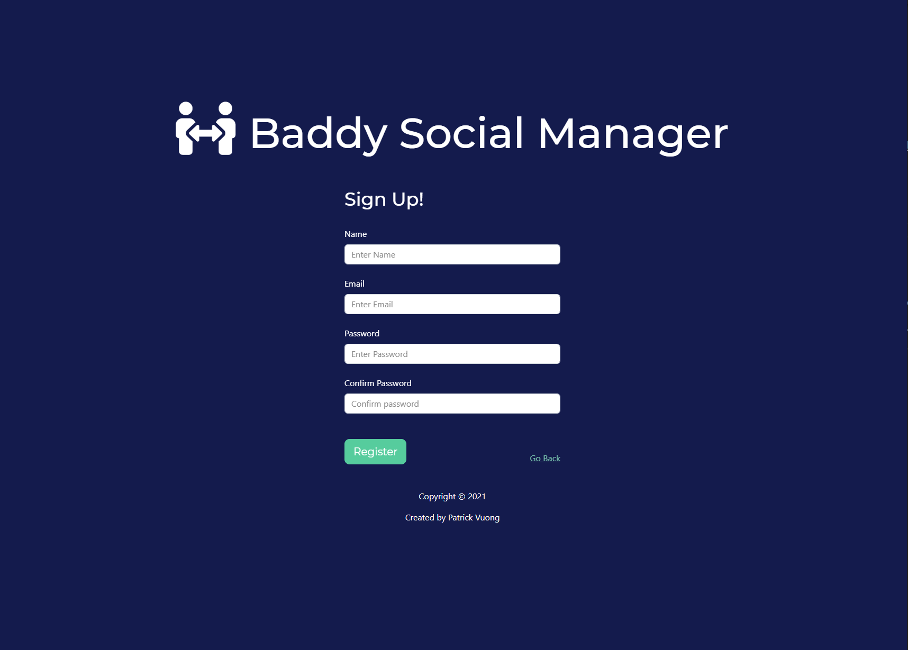
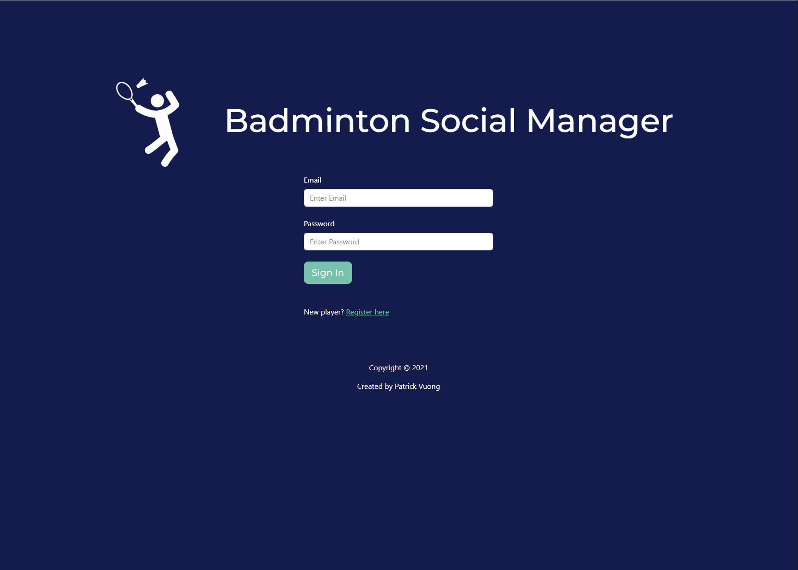
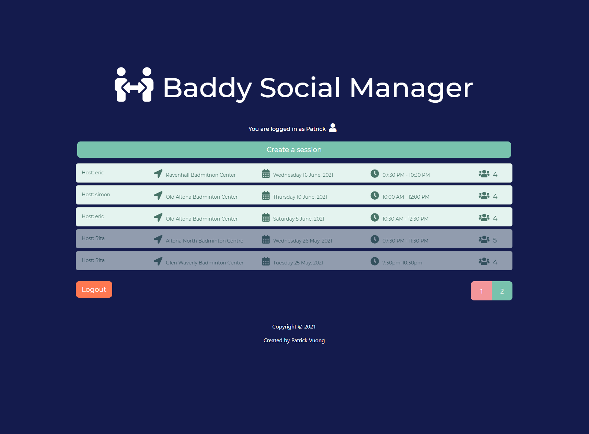
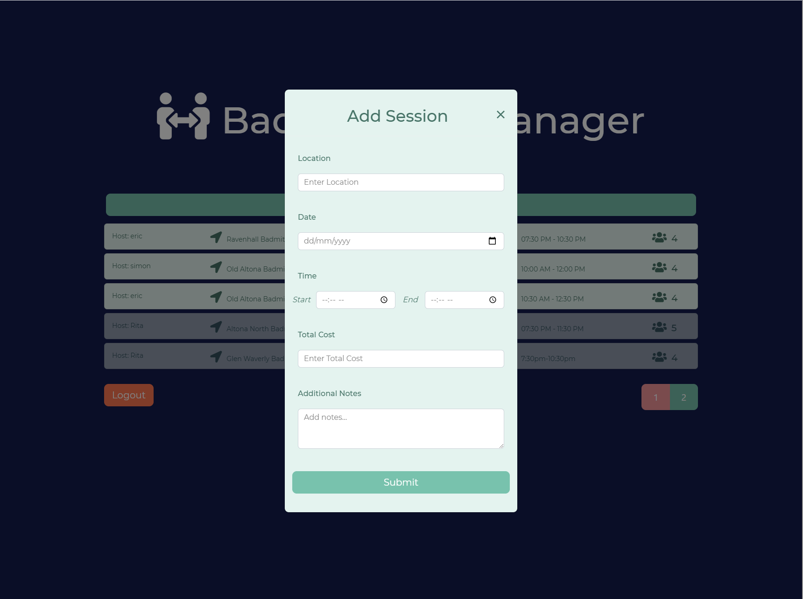
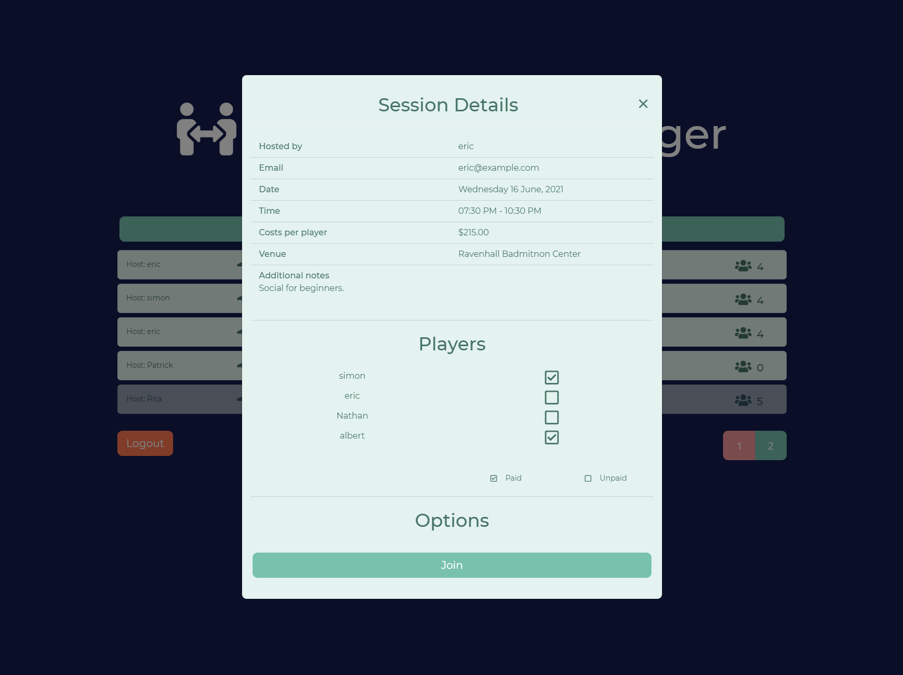
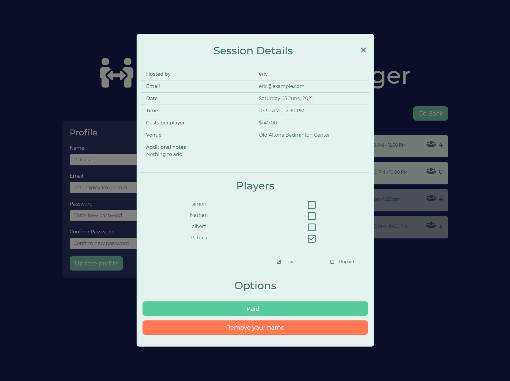
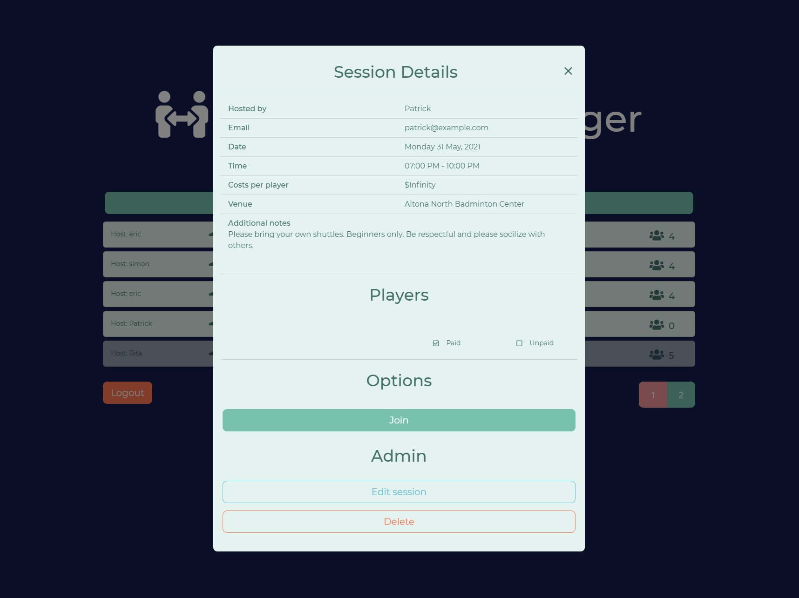
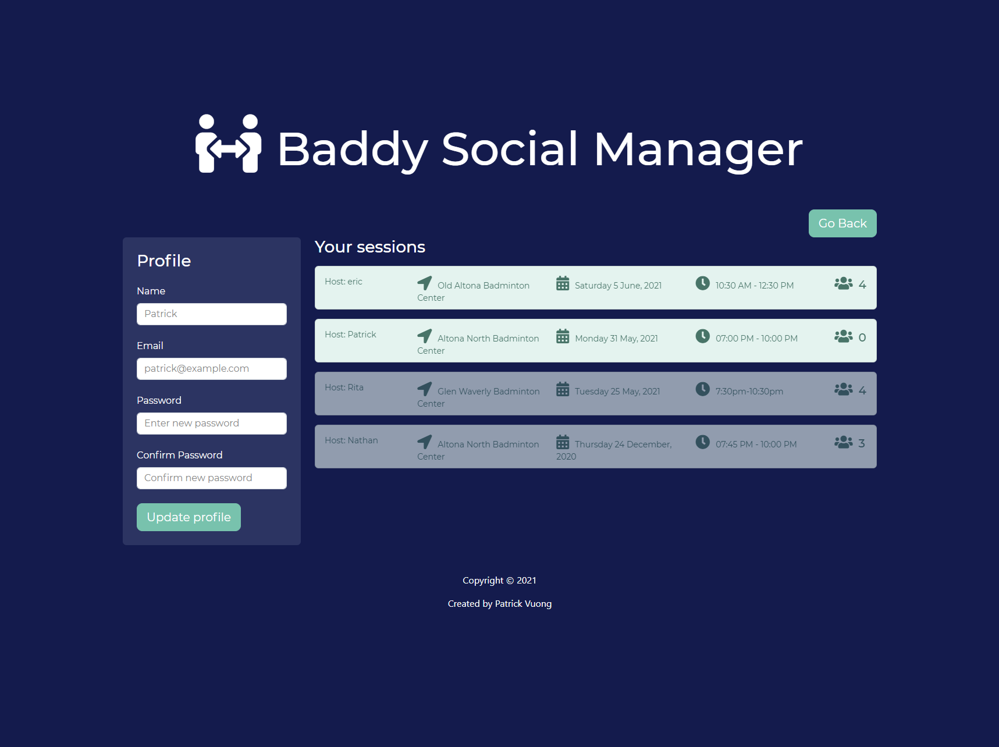

<h1>Badminton Social Manager</h1>

Applicaton to manage social badminton sessions.

[DEMO Hosted on AWS EC2](ec2-3-84-104-222.compute-1.amazonaws.com)

 Tech stack includes MongoDB, Express, React and NodeJS. Hosted on AWS EC2 Instance, with database hosted on MongoDB (Migrated from AWS DocumentDB)

<h2>Features</h2>
<ul>
  <li>Creating sessions</li>
  <li>Joining sessions</li>
  <li>Showing the list of players associated with the session</li>
  <li>Marking off paid players</li>
  <li>Editing session</li>
  <li>Deleting sessions</li>
  <li>Unjoin sessions</li>
</ul>

<h2>Setup</h2>

Requires a mongoDB database with collection for users and sessions. 
 Sign up and setup a collection from <a href='https://www.mongodb.com'>https://www.mongodb.com/</a>

Simply register an account from the front page.

 
</img>

Log in to view available sessions.

 
</img>
</img>

To create a session, simply click "create a session" and fill in the details.

 
</img>

If you are not the creator of the session, the only option will be to join the session.
 
</img>

To mark yourself off as paid, simply click on the "Mark as paid" toggle box. A tick should appear next to your name.  
Note: If the session has not been completed yet, there will also be an option to remove your name.
 
</img>

If you are the creator of the session there will be admin controls available to you. These allow you to delete and edit the session.
 
</img>

Click on the user icon next to your name to view or edit your profile. This section also shows all the sessions you are involved in; those that you have joined and created.
 
</img>

Past sessions are the transparents ones. Once you have joined a session and the date has passed, you will be unable to remove yourself from the session.
 

<h2>Features to add:</h2>

<ul>
<li> Edit session - done </li>
<li> Payment feature - done</li>
<li> Waiting List</li>
<li> Email notification for waiting list</li>
<li> Payment via paypal API</li>
</ul>
